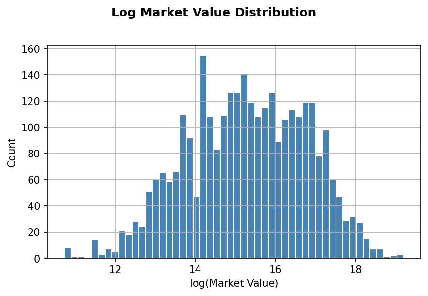

# European Soccer Player Market Value Prediction

## Project Overview
What is an accurate market value for a european soccer player given stats like goals, assists, minutes played, etc?

**Data Source:** [European Top Leagues Player Stats 25-26 (Kaggle)](https://www.kaggle.com/datasets/kaanyorgun/european-top-leagues-player-stats-25-26) 

**Techniques:** Regression Modeling, Scaling, Encoding, Grid Search over multiple hyperparameters to find the most optimal choices. Ridge/Lasso regression. Feature Engineering. 

**Expected Results:** Per-position modeling will be the most accurate. League and goal-related features will affect market value the most for offensive players. Saves and interceptions will affect market value for defensive players more. The number of cards received and tackles will affect all players the least.

**Why:** Modeling can be used to determine if a player is being under or over valued. This can influence salary decisions which will maximize the team's expected performance while still meeting salary cap requirements.

## Data
 - player_id  
 - name
 - league_x    
 - position    
 - **market_value** (Target Variable)
 - league_y   
 - appearances  
 - matches_started  
 - minutes_played  
 - goals  
 - assists  
 - expected_goals
 - expected_assists
 - rating
 - total_shots  
 - shots_on_target  
 - yellow_cards  
 - red_cards  
 - tackles  
 - interceptions  
 - saves  

## Data Preparation and Feature Engineering
- Merged two input datasets base on a shared `player_id` column
- Dropped unneeded column (`name`)
- Filled missing `expected_goals` and `expected_assists` values with per-position medians
- Filtered out players with less than 270 minutes played to reduce noise
- Dropped highly-correlated columns (`matches_started`, `appearances`, `shots_on_target`)
- Dropped rows with missing `market_value` (target variable)
- Introduced new model target (`log_market_value`) to account for skewed `market_value` data
- Converted many features to per-90-minute values to help distinguish players who have higher stats simply because they have played longer.
- Removed outliers in `log_market_value` using IQR method

## Features Used
| Feature | Type |
|---|---|
| `league` | Categorical |
| `position` | Categorical |
| `minutes_played` | Numeric |
| `rating` | Numeric |
| `goals_per90` | Numeric |
| `assists_per90` | Numeric |
| `expected_goals_per90` | Numeric |
| `expected_assists_per90` | Numeric |
| `total_shots_per90` | Numeric |
| `tackles_per90` | Numeric |
| `interceptions_per90` | Numeric |
| `yellow_cards_per90` | Numeric |
| `red_cards_per90` | Numeric |
| `saves_cards_per90` | Numeric |

## Modeling
Ridge, Lasso, XGBoost, and Random Forest were each used with GridSearchCV for hyperparameter tuning.  Both a global model including all positions and per-position models were created.  Model performance results are below (values in Euros).

### Global Model (3054 players)
| Model | R^2 | MAE | RMSE |
|---|---|---|---|
| Lasso | 0.518 | 7.1M | 13.7M |
| Ridge | 0.518 | 7.1M | 13.7M |
| XGBoost | 0.513 | 7.3M | 14.5M |
| Random Forest | 0.502 | 7.3M | 15.5M |

### Forwards Model (606 players)

| Model | R^2 | MAE | RMSE |
|---|---|---|---|
| Lasso | 0.516 | 7,7M | 19.8M |
| Ridge | 0.516 | 7.7M | 19.8M |
| XGBoost | 0.499 | 8.1M | 20.7M |

### Midfielders Model (1,182 players)

| Model | R^2 | MAE | RMSE |
|---|---|---|---|
| Lasso | 0.563 | 6.1M | 14.3M |
| Ridge | 0.563 | 6.1M | 14.3M |
| XGBoost | 0.564 | 6.7M | 16.2M |

### Defenders Model (1,041 players)

| Model | R^2 | MAE | RMSE |
|---|---|---|---|
| Lasso | 0.493 | 4.8M | 7.8M |
| Ridge | 0.493 | 4.8M | 7.8M |
| XGBoost | 0.501 | 5.5M | 9.2M |

### Goalkeepers Model (225 players)

| Model | R^2 | MAE | RMSE |
|---|---|---|---|
| Lasso | 0.339 | 3.7M | 6.6M |
| Ridge | 0.346 | 3.8M | 6.8M |
| XGBoost | 0.367 | 4.9M | 8.2M |

The global model outperformed per-league models with the exception of midfielders.  The goalkeepers model degraded significantly due to the small sample size. 

### Most Important Features (Lasso Coefficients by Magnitude)

| Feature | Coefficient |
|---|---|
| league_Eredivisie | -1.35 |
| league_Premier League | +1.31 |
| red_cars_per90 | +1.24 |
| position_G | +1.13 |
| league_Liga Portugal | -1.11 |
| league_Super Lig | -1.09 |

League membership in either Eredivisie, Premier, Liga Portugal, or Super Lig are high predictors of market value.  Red cards per 90 indicates aggressive players are valued more and goalkeepers are also valued highly.

## Analysis

Overall, our models do not perform well, suggesting that we are missing data that is required to accurately model market value.  Our data set, mostly performance-related statistics, explains only about 52% of market value variance.

## Audit

An audit was performed of the most inaccurately predicted market values (both low and high) to analyze patterns.  Ages of these players was then manually researched and added to the following tables.

### Most Undervalued Players (model predicts higher than actual)

| Player | Position | League | Age | Actual Value | Predicted Value | % Difference |
|---|---|---|---|---|---|---|
| Karl Darlow | G | Premier League | 35 | 210K | 13.0M | +6096.6% |
| Nenê | F | Liga Portugal | 42 | 52K | 3.2M | +6021.2% |
| Marius Courcoul | D | Ligue 1 | 19 | 53K | 2.6M | +4850.8% |
| Stephan Zagadou | D | Ligue 1 | 17 | 97K | 3.5M | +3532.6% |
| Josan | M | LaLiga | 36 | 105K | 3.7M | +3387.8% |
| Matías Dituro | G | LaLiga | 38 | 205K | 6.5M | +3057.5% |
| Bebeto | D | Liga Portugal | 35 | 53K | 1.6M | +2827.4% |
| Santi Cazorla | M | LaLiga | 41 | 195K | 5.1M | +2506.8% |
| Idrissa Gueye | M | Premier League | 36 | 970K | 25.1M | +2489.9% |
| Nathaniel Clyne | D | Premier League | 34 | 465K | 11.3M | +2321.8% |
| Nícolas | G | Serie A | 37 | 110K | 2.4M | +2119.7% |
| Youssef El Arabi | F | Ligue 1 | 38 | 140K | 3.0M | +2064.6% |
| Hennes Behrens | D | Bundesliga | 21 | 410K | 8.6M | +2008.8% |
| Mahamadou Nagida | D | Ligue 1 | 20 | 145K | 3.0M | +1957.6% |
| Veysel Sarı | D | Super Lig | 37 | 97K | 1.8M | +1790.6% |

### Most Overvalued Players (model predicts lower than actual)

| Player | Position | League | Age | Actual Value | Predicted Value | % Difference |
|---|---|---|---|---|---|---|
| Ousmane Diomande | D | Liga Portugal | 22 | 48.0M | 2.1M | -95.6% |
| João Simões | M | Liga Portugal | 19 | 15.9M | 865K | -94.6% |
| Anatoliy Trubin | G | Liga Portugal | 24 | 30.0M | 1.8M | -94.1% |
| Thiago Pitarch | M | LaLiga | N/A | 18.2M | 1.1M | -94.1% |
| Josip Šutalo | D | Eredivisie | 26 | 16.4M | 1.0M | -93.9% |
| Givairo Read | D | Eredivisie | 19 | 24.0M | 1.5M | -93.8% |
| Zeno Debast | D | Liga Portugal | 22 | 31.0M | 2.1M | -93.2% |
| Rodrigo Mora | M | Liga Portugal | 18 | 42.0M | 2.9M | -93.2% |
| Alan Varela | M | Liga Portugal | 24 | 35.0M | 2.4M | -93.0% |
| Geovany Quenda | M | Liga Portugal | 18 | 49.0M | 3.4M | -93.0% |
| Diogo Costa | G | Liga Portugal | 26 | 42.0M | 3.0M | -92.8% |
| Edson Álvarez | M | Super Lig | 28 | 17.5M | 1.3M | -92.5% |
| Fotis Ioannidis | F | Liga Portugal | 26 | 19.2M | 1.4M | -92.5% |
| Achraf Hakimi | D | Ligue 1 | 27 | 82.0M | 6.1M | -92.5% |
| Sacha Boey | D | Super Lig | 25 | 13.9M | 1.1M | -92.4% |

From the audit, we can see a larger driver of the modeling innacuracies is age of the player. The Undervalued Players table mainly contains players aged 34 to 42.  These older players are at the end of their careers and thus have a lower market value becuase their performance is expected to degrade or they will retire soon.  The Overvalued Players table contains entirely players less than 28 years old.  These are players with high established performance and many years left in their careers, thus increasing their value.  This finding is corroborated from the Transfermarkt research website, which contains stat on Soccer players.  Their article [Transfermarkt Market Value explained - How is it determined?](https://www.transfermarkt.co.in/transfermarkt-market-value-explained-how-is-it-determined-/view/news/385100) lists the top two most important factors are future prospects and age.  

## Future Improvements
- Add age data to the feature set, which will improve modeling accurracy
- Use more advanced modeling techniques such as neural networks
- Collect more data and re-assess per-position modeling
