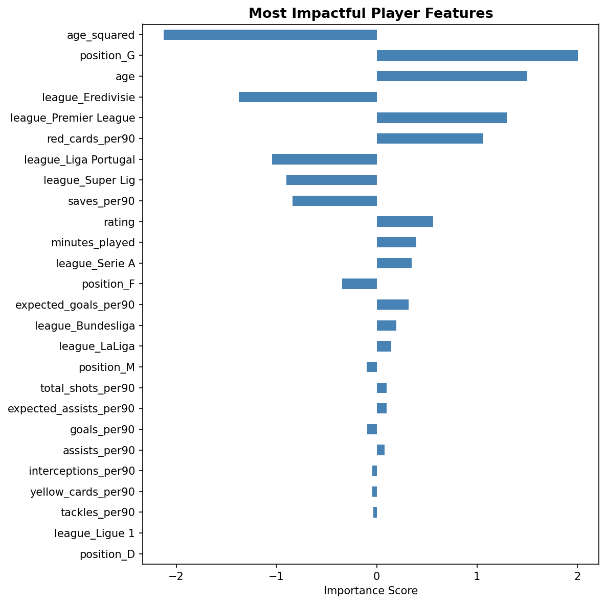

# European Soccer Player Market Value

## Project Overview
Transfermarkt market values for European soccer players are calculated based on multiple on-field factors of performance statistics as well as off-field factors like advertising value, reputation, and existing contract length.  A performance-focused team that scouts for players whose market value is weighted heavily by off-field factors could improve the efficency of their salary pool by targeting players that are undervalued and avoiding players that are overvalued. Can we model player market value well enough to identify players whose market values are disproportionately driven by off-field factors?

See: [Transfermarkt Market Value explained - How is it determined?](https://www.transfermarkt.co.in/transfermarkt-market-value-explained-how-is-it-determined-/view/news/385100)

## Summary of Findings
Our regression model achieved an R^2 of 0.648 with XGBoost performing the best.  This means that our data set of performance statistics, position, age, and league together explain approximately 65% of the variance in Transfermarkt player market values.  The remaining 35% can be attributed to other off-field features not present in our data set as well as noise and modeling imperfections.  

Feature importance analysis shows that league membership and age are dominant factors, with on-field performance having a lesser impact.  Given that our data set includes comprehensive performance features, we can infer that players whose actual market value significantly differs from their model predicted value are likely priced more heavily on non-performance factors outside of our data set than on factors that would directly affect the outcome of a game.  This is particularly true for players on both the lower and upper end of the age spectrum, where our model shows market value is disproportionately influenced.

[Modeling Notebook]()"futbol_player_market_value.ipynb")
[Age Data Retrieval Notebook]()"build_player_age_data.ipynb")

## Data
A data set was procured from Kaggle containing on-field player statistics, league, and Transfermarkt market values.  This data was then augmented with player age gathered from Wikipedia.  

**Data Sources:** 
 - [European Top Leagues Player Stats 25-26 (Kaggle)](https://www.kaggle.com/datasets/kaanyorgun/european-top-leagues-player-stats-25-26)
   - Market Value from [Transfermarkt](https://www.transfermarkt.com/)
   - Performance metrics from [Sofascore](https://www.sofascore.com/)
 - [Wikipedia](https://www.wikipedia.com)

**Data**
 - **Market Value** (Target Variable)
 - Id  
 - Name
 - Age
 - League
 - Position    
 - Appearances  
 - Matches Started  
 - Minutes Played  
 - Goals  
 - Assists  
 - Expected_goals
 - Expected_assists
 - Rating
 - Total Shots  
 - Shots on Target  
 - Yellow Cards  
 - Red Cards  
 - Tackles  
 - Interceptions  
 - Saves  

## Data Preparation and Feature Engineering
- Merged two input datasets based on a shared `player_id` column
- Dropped unneeded column (`name`)
- Filled missing `expected_goals` and `expected_assists` values with per-position medians
- Filtered out players with less than 270 minutes played to reduce noise
- Dropped highly-correlated columns (`matches_started`, `appearances`, `shots_on_target`)
- Dropped rows with missing `market_value` (target variable)
- Introduced new model target (`log_market_value`) to account for skewed `market_value` data
- Converted many features to per-90-minute values to help distinguish players who have higher stats simply because they have played longer.
- Removed outliers in `log_market_value` using IQR method
- Downloaded `date_of_birth` for all players by name and added `age` and `age_squared` features.

## Features Used
| Feature | Type |
|---|---|
| `league` | Categorical |
| `position` | Categorical |
| `minutes_played` | Numeric |
| `rating` | Numeric |
| `goals_per90` | Numeric |
| `assists_per90` | Numeric |
| `expected_goals_per90` | Numeric |
| `expected_assists_per90` | Numeric |
| `total_shots_per90` | Numeric |
| `tackles_per90` | Numeric |
| `interceptions_per90` | Numeric |
| `yellow_cards_per90` | Numeric |
| `red_cards_per90` | Numeric |
| `saves_cards_per90` | Numeric |
| `age` | Numeric |
| `age_squared` | Numeric |

## Modeling without Age
Ridge, Lasso, XGBoost, and Random Forest were each used with GridSearchCV for hyperparameter tuning.  Both a global model including all positions and per-position models were created.  R^2 was chosen as the evaluation metric as it measures the variance in player market value that is explained by the model and more directly answers the core project objective.  Model performance results are below (values in Euros).

### Global Model (3054 players)
| Model | R^2 | MAE | RMSE |
|---|---|---|---|
| Lasso | 0.518 | 7.1M | 13.7M |
| Ridge | 0.518 | 7.1M | 13.7M |
| XGBoost | 0.513 | 7.3M | 14.5M |
| Random Forest | 0.502 | 7.3M | 15.5M |

### Forwards Model (606 players)

| Model | R^2 | MAE | RMSE |
|---|---|---|---|
| Lasso | 0.516 | 7.7M | 19.8M |
| Ridge | 0.516 | 7.7M | 19.8M |
| XGBoost | 0.499 | 8.1M | 20.7M |

### Midfielders Model (1,182 players)

| Model | R^2 | MAE | RMSE |
|---|---|---|---|
| Lasso | 0.563 | 6.1M | 14.3M |
| Ridge | 0.563 | 6.1M | 14.3M |
| XGBoost | 0.564 | 6.7M | 16.2M |

### Defenders Model (1,041 players)

| Model | R^2 | MAE | RMSE |
|---|---|---|---|
| Lasso | 0.493 | 4.8M | 7.8M |
| Ridge | 0.493 | 4.8M | 7.8M |
| XGBoost | 0.501 | 5.5M | 9.2M |

### Goalkeepers Model (225 players)

| Model | R^2 | MAE | RMSE |
|---|---|---|---|
| Lasso | 0.339 | 3.7M | 6.6M |
| Ridge | 0.346 | 3.8M | 6.8M |
| XGBoost | 0.367 | 4.9M | 8.2M |

The global model outperformed per-position models with the exception of midfielders.  The goalkeepers model degraded significantly due to the small sample size.  The global model was selected for final analysis as it outperformed per-position models in most cases and benefited from the full training dataset.

### Most Important Features (Lasso Coefficients by Magnitude)

| Feature | Coefficient |
|---|---|
| league_Eredivisie | -1.35 |
| league_Premier League | +1.31 |
| red_cards_per90 | +1.24 |
| position_G | +1.13 |
| league_Liga Portugal | -1.11 |
| league_Super Lig | -1.09 |

League membership in either Eredivisie, Premier, Liga Portugal, or Super Lig are high predictors of market value.  Red cards per 90 indicates aggressive players are valued more and goalkeepers are also valued highly.

### Audit

An audit was performed of the most inaccurately predicted market values (both low and high) to analyze patterns.  Ages of these players was then manually researched and added to the following tables.

#### Most Undervalued Players (model predicts higher than actual)

| Player | Position | League | Age | Actual Value | Predicted Value | % Difference |
|---|---|---|---|---|---|---|
| Karl Darlow | G | Premier League | 35 | 210K | 13.0M | +6096.6% |
| Nenê | F | Liga Portugal | 42 | 52K | 3.2M | +6021.2% |
| Marius Courcoul | D | Ligue 1 | 19 | 53K | 2.6M | +4850.8% |
| Stephan Zagadou | D | Ligue 1 | 17 | 97K | 3.5M | +3532.6% |
| Josan | M | LaLiga | 36 | 105K | 3.7M | +3387.8% |
| Matías Dituro | G | LaLiga | 38 | 205K | 6.5M | +3057.5% |
| Bebeto | D | Liga Portugal | 35 | 53K | 1.6M | +2827.4% |
| Santi Cazorla | M | LaLiga | 41 | 195K | 5.1M | +2506.8% |
| Idrissa Gueye | M | Premier League | 36 | 970K | 25.1M | +2489.9% |
| Nathaniel Clyne | D | Premier League | 34 | 465K | 11.3M | +2321.8% |
| Nícolas | G | Serie A | 37 | 110K | 2.4M | +2119.7% |
| Youssef El Arabi | F | Ligue 1 | 38 | 140K | 3.0M | +2064.6% |
| Hennes Behrens | D | Bundesliga | 21 | 410K | 8.6M | +2008.8% |
| Mahamadou Nagida | D | Ligue 1 | 20 | 145K | 3.0M | +1957.6% |
| Veysel Sarı | D | Super Lig | 37 | 97K | 1.8M | +1790.6% |

#### Most Overvalued Players (model predicts lower than actual)

| Player | Position | League | Age | Actual Value | Predicted Value | % Difference |
|---|---|---|---|---|---|---|
| Ousmane Diomande | D | Liga Portugal | 22 | 48.0M | 2.1M | -95.6% |
| João Simões | M | Liga Portugal | 19 | 15.9M | 865K | -94.6% |
| Anatoliy Trubin | G | Liga Portugal | 24 | 30.0M | 1.8M | -94.1% |
| Thiago Pitarch | M | LaLiga | 18 | 18.2M | 1.1M | -94.1% |
| Josip Šutalo | D | Eredivisie | 26 | 16.4M | 1.0M | -93.9% |
| Givairo Read | D | Eredivisie | 19 | 24.0M | 1.5M | -93.8% |
| Zeno Debast | D | Liga Portugal | 22 | 31.0M | 2.1M | -93.2% |
| Rodrigo Mora | M | Liga Portugal | 18 | 42.0M | 2.9M | -93.2% |
| Alan Varela | M | Liga Portugal | 24 | 35.0M | 2.4M | -93.0% |
| Geovany Quenda | M | Liga Portugal | 18 | 49.0M | 3.4M | -93.0% |
| Diogo Costa | G | Liga Portugal | 26 | 42.0M | 3.0M | -92.8% |
| Edson Álvarez | M | Super Lig | 28 | 17.5M | 1.3M | -92.5% |
| Fotis Ioannidis | F | Liga Portugal | 26 | 19.2M | 1.4M | -92.5% |
| Achraf Hakimi | D | Ligue 1 | 27 | 82.0M | 6.1M | -92.5% |
| Sacha Boey | D | Super Lig | 25 | 13.9M | 1.1M | -92.4% |

From the audit, we can see a larger driver of the modeling innacuracies is age of the player. The Undervalued Players table mainly contains players aged 34 to 42.  These older players are at the end of their careers and thus have a lower market value because their performance is expected to degrade or they will retire soon.  The Overvalued Players table contains entirely players less than 28 years old.  These are players with high established performance and many years left in their careers, thus increasing their value.  

## Modeling with Age

Player dates of birth were gathered from Wikipedia entries and new features of `age` and `age_squared` were introduced.  The global modeling was then refit with the additional data with the following results:

| Model | R^2 | MAE | RMSE |
|---|---|---|---|
| Lasso | 0.641 | 6.5M | 13.7M |
| Ridge | 0.641 | 6.5M | 13.7M |
| XGBoost | 0.648 | 6.4M | 13.6M |
| Random Forest | 0.618 | 6.5M | 14.5M |

As we predicted, age is a significant factor in a player's salary.  Including the age raised our best model performance by an R^2 of 0.130 up to 0.648.

### Breakdown of Feature Impact

**Age -** Looking at the features ranked by impact, we see just how much player age impacts market value.  Interestingly, the square of age is a large negative impact while the age itself is a large positive impact.  This indicates a U-shape to the data where both relatively old and relatively young players are valued much less while players in the middle of their careers are valued more.  

**Position -** Goalies are highly valued, but other positions have a much smaller impact on market value, with defenders having no impact.  Also interesting is that saves per 90 has a relatively large negative impact while goalies have a high positive impact.  This may be because a large number of saves indicates many shots-on-goal from the opposing team and therefore the player is on a weaker team, and thus has a lower market value.  This implies that goalies with a large number of saves, and are thus highly-performing, are actually undervalued.  

**Rating -** Player rating, a comprehensive value of a player's performance, has only a moderate impact.  This, more than anything else, reinforces just how little player performance impacts market value.

**Minutes Played -** Minutes played also has a moderate positive impact as players with more experience are more valued.

**Per 90 -** Red cards per 90 has a large positive impact, suggesting that aggressive players are highly valued.  Saves per 90 has a large negative impact, as discussed above.  The other per 90 performance features had very little impact on player market value.  This may be because of their moderate correlation with rating.

**League -** The impact of league follows exactly what we would expect given the league rankings.  Premier league is a the top, and has the highest positive impact on market value.  Eredivisie is at the bottom and has the largest negative impact.  The other leagues contribute based on their position in the ranking as well.

The remaining variance can be attributed to other off-field factors that did not exist in the data set.

## Conclusion

The market value of players is driven more by non-performance factors such as age and league than by the on-field performance factors that affect the outcome of a game.  Our model, which was trained with on-field performance factors, explains 65% of market value variance.  The remaining 35% can be attributed to off-field, non-performance factors like advertising value, reputation, and existing contract length.  The model's difference between predicted and actual market value is a signal of how heavily players' market values are influenced by these non-performance factors.  It is therefore a useful screening tool to identify players that warrant further investigation for clubs looking to make performance-focused recruiting decisions.  Players whose predicted value significantly exceeds their actual market value, particularly those at the ends of the age spectrum, are the strongest candidates for further investigation to identify undervalued players.

### Players to Investigate

With the conclusion above, we can search our data set for players that we should target for further investigation.  These players should have a high rating, indicating that they have good on-field performance.  They should also be on the upper or lower end of the age spectrum, which we know from our modeling are under-valued players.  Finally, they should have a relatively large difference in actual vs predicted market value, which we've concluded means their value is impacted by off-field factors not in our data set.

| Name | Position | League | Age | Rating | Actual Value | Predicted Value | % Difference |
|---|---|---|---|---|---|---|---|
| Lionel M'Pasi | G | Ligue 1 | 32 | 7.83 | 370K | 630K | +70.4% |
| Yan Diomande | F | Bundesliga | 20 | 7.69 | 49.0M | 61.4M | +25.3% |
| Rémy Descamps | G | Ligue 1 | 30 | 7.66 | 1.9M | 4.6M | +144.4% |
| Luka Modrić | M | Serie A | 41 | 7.57 | 4.4M | 6.9M | +57.0% |
| Ronald Koeman Jr | G | Eredivisie | 31 | 7.50 | 595K | 1.3M | +111.6% |
| Nicolás Otamendi | D | Liga Portugal | 38 | 7.48 | 1.1M | 1.6M | +44.6% |

### Next Steps

- Per-position modeling may have been hindered by the low amounts of training data.  Collect more data and re-assess per-position modeling.
- Collect data on off-field characteristics to identify the most important off-field drivers of market value.